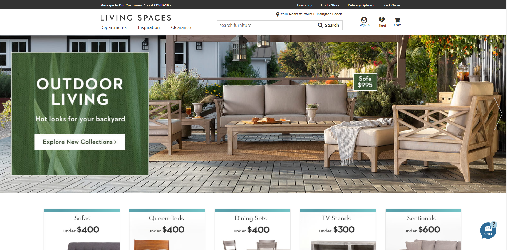

# ls-landing-clone

> - Maintained by: `James Dinh - jdinh8124`

## Summary
- jQuery practice by imitating the LS website. Also built using JavaScript (ES5 & ES6), CSS3, HTML5, and Boostrap 4

## Technologies Used:
- HTML5
- JavaScript (ES5 & ES6)
- CSS3
- Boostrap 4
- jQuery
- SlickSlider CDN
- Google Chrome Dev Tools to analyze page layout
- Font Awesome

## Future Additions
- Deployment
- Mobile Responsiveness
- Flexbox restructuring 
- Working links

## Template

## Demo

